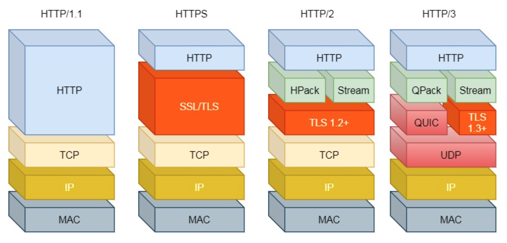

# 图解网络 by 小林coding

## 基础篇

- TCP/IP网络模型：应用层，传输层，网络层，数据链路层，物理层

### 应用层 Application Layer
我们能直接接触到的，电脑/手机上的app都是在应用层实现。设备通信时，app就把数据传给下一层，即传输层。应用层不关心数据如何传输，只需要专注为用户提供应用功能。
应用层工作在操作系统的用户态，传输层及以下工作在内核态。

### 传输层 Transport Layer
应用层的数据包传给传输层，传输层为应用层提供网络支持。传输层有2个传输协议——TCP和UDP。

TCP全称叫传输层控制协议 (Transmission Control Protocol)。TCP相比UDP多了很多特性，比如流量控制、超时重传、拥塞控制等，这些都是为了保证数据包能可靠地传输给对方。

UDP只负责发送数据包，不保证数据包是否抵达对方，实时性相对更好、传输效率高。

传输的数据非常大时，当大小超过MSS（TCP最大报文段长度），就要将数据包分块，这样如果某个块丢失or损坏了，只需要重新传这一个分块而不是整个数据包。TCP协议中，每个分块称为一个TCP Segment。

一台设备上可能很多应用在接收or传输数据，因此需要用一个编号将应用区分开，这个编号就是 **端口** 。比如80端口通常是web服务器用的，22端口是远程登陆服务器用的等等。浏览器中每个标签栏都是一个独立的进程，OS会为这些进程分配临时端口号。

### 网络层 Internet Layer
传输层并不负责数据的传输，只充当应用间数据传输的媒介，帮助实现应用到应用的通信，实际的传输功能由网络层负责。

网络层最常用的是IP协议 (Internet Protocol)，IP协议将传输层的报文作为数据部分，再加上IP包头组装成IP报文，如果IP报文大小超过MTU（以太网中一般为1500 bytes）就会再次进行分片，得到一个即将发送到网络的IP报文。

网络层负责将数据从一个设备传输到另一个设备，但设备那么多，因此网络层需要有区分设备的编号。一般用IP地址给设备进行编号，对于IPv4协议，IP地址共32位，由4段每段8位组成。IP地址虽然可以区分设备，但是寻址起来很麻烦，因此需要将IP地址分成2种意义：1) **网络号**: 负责标识该IP地址属于哪个子网的; 2) **主机号**: 负责标识同一子网下的不同主机。具体怎么分，需要配合**子网掩码**才能算出IP地址的网络号和主机号。那么在寻址过程中，先匹配到相同的网络号，才会去找对应的主机。

除了寻址能力， IP协议还有另一个重要的能力就是**路由**。实际场景中，2台设备并不是用一根网线连起来的，而是通过很多网关、路由器、交换机等，就会形成很多网络路径，因此当数据包到达一个网络节点，就需要通过算法决定下一步走哪条路径。

**IP协议的寻址作用是告诉我们去往下一个目的地该朝哪个方向走，路由则是根据「下一个目的地」选择路径。寻址更像在导航，路由更像在操作方向盘。**

### 数据链路层 Data Link Layer
实际场景中，网络并不是一个整体。比如你家和我家就不属于一个网络，我们之间的数据传输需要跨网络，一旦需要跨网络，就需要有一个设备同时在两个网络当中，这个设备一般是路由器，路由器可以通过路由表计算出下一个要去的IP地址。那么，路由器怎么知道这个IP地址是哪个设备的呢？需要有一个专门的层来标识网络中的设备，让数据在一个链路中传输，这就是**数据链路层**，它主要为网络层提供链路级别传输的服务。

每台设备的网卡有一个MAC地址，用来唯一标识设备的。路由器计算出下一个目的地IP地址，再通过ARP协议找到该目的地的MAC地址，这样就知道这个IP地址是哪个设备的了。

### 物理层 Physical Layer
当数据准备要从设备发送到网络时，需要把数据包转换成电信号，让其可以在物理介质中传输，这一层就是**物理层**，它主要为数据链路层提供二进制传输的服务。

## HTTP篇

HTTP全称是HyperText Transfer Protocol，超文本传输协议。

HTTP 协议是一个双向协议，在两点之间传输数据。

### HTTP常见面试题
- HTTP常见的状态码有哪些？

|状态码类别|含义|常见状态码|
|---|---|---|
|1xx|**提示信息**，表示目前是协议处理的中间状态，还需要后续操作||
|2xx|**成功**，报文已经收到并被正确处理|200,204,206|
|3xx|**重定向**，资源位置发生变动，需要客户端重新发送请求|301,302,304|
|4xx|**客户端错误**，请求报文有误，服务器无法处理|400,403,404|
|5xx|**服务器错误**，服务器在处理请求时内部发生了错误|500,501,502,503|

「200 OK」是最常⻅的成功状态码，表示一切正常。如果是非HEAD请求，服务器返回的响应头都会有body数据。

「204 No Content」也是常⻅的成功状态码，与200 OK基本相同，但响应头没有body数据。

「206 Partial Content」是应用于HTTP分块下载或断点续传，表示响应返回的body数据并不是资源的全部，而是其中的一部分，也是服务器处理成功的状态。

「301 Moved Permanently」表示永久重定向，说明请求的资源已经不存在了，需改用新的URL再次访问。

「302 Found」表示临时定向，说明请求的资源还在，但暂时需要用另一个URL来访问。301和302都会在响应头里使用字段Location ，指明后续要跳转的URL，浏览器会自动重定向新的URL。

「304 Not Modified」不具有跳转的含义，表示资源未修改，重定向已存在的缓冲文件，也称缓存重定向，用于缓存控制。

「400 Bad Request」表示客户端请求的报文有错误，但只是个笼统的错误。

「403 Forbidden」表示服务器禁止访问资源，并不是客户端的请求出错。

「404 Not Found」表示请求的资源在服务器上不存在或未找到，所以无法提供给客户端。

「500 Internal Server Error」与400类型，是个笼统通用的错误码，服务器发生了什么错误，我们并不知道。

「501 Not Implemented」表示客户端请求的功能还不支持，类似“即将开业，敬请期待”的意思。

「502 Bad Gateway」通常是服务器作为网关或代理时返回的错误码，表示服务器自身工作正常，访问后端服务器 发生了错误。

「503 Service Unavailable」表示服务器当前很忙，暂时无法响应服务器，类似“网络服务正忙，请稍后重试”的意思。

- HTTP常见字段有哪些？

|字段|作用|
|---|---|
|Host|客户端发送请求时，用来指定服务器域名。有了Host字段，就可以将请求发往同一台服务器上的不同网站。|
|Content-Length|服务器返回数据时，会有Content-Length字段，表明本次回应的数据长度。|
|Connection|常见于客户端要求服务器使用TCP持久连接，以便其他请求复用。|
|Content-Type|用于服务器回应时，告诉客户端本次数据是什么格式。|
|Content-Encoding|说明数据的压缩方法，表示服务器返回的数据使用了什么压缩格式|

- GET与POST的区别？

Get是请求从服务器获取资源。POST是向URI指定的资源提交数据，数据就放在报文的body里。

- GET和POST方法都是安全和幂等的吗？

概念：在HTTP协议里，所谓的「安全」是指请求方法不会「破坏」服务器上的资源。 所谓的「幂等」，意思是多次执行相同的操作，结果都是「相同」的。

因此显然GET方法是安全且幂等的，因为它是read only的操作。POST是新增or提交数据的操作，会修改服务器上的资源，所以是不安全的，且多次提交数据会创建多个资源，所以不是幂等的。

- HTTP (1.1)优缺点有哪些？如何体现的？

HTTP 最凸出的优点是「简单、灵活和易于扩展、应用广泛和跨平台」。

1) 简单: HTTP 基本的报文格式就是header + body，头部信息也是 key-value 简单文本的形式，易于理解，降低了学习 和使用的⻔槛。

2) 灵活和易于扩展: HTTP协议里的各类请求方法、URI/URL、状态码、头字段等每个组成要求都没有被固定死，都允许开发人员自定义和扩充。同时 HTTP 由于是工作在应用层( OSI 第七层)，则它下层可以随意变化。HTTPS 也就是在 HTTP 与 TCP 层之间增加了 SSL/TLS 安全传输层，HTTP/3 甚至把 TCP 层换成了基于 UDP 的 QUIC。

3) 应用广泛和跨平台: 互联网发展至今，HTTP 的应用范围非常的广泛，从台式机的浏览器到手机上的各种 APP，从看新闻、刷贴吧到购物、理财、吃鸡，HTTP 的应用片地开花，同时天然具有跨平台的优越性。

HTTP 协议里有优缺点一体的双刃剑，分别是「无状态、明文传输」，同时还有一大缺点「不安全」。

1) 无状态双刃剑: 无状态的好处，因为服务器不会去记忆HTTP的状态，所以不需要额外的资源来记录状态信息，这能减轻服务器的负担，能够把更多的CPU和内存用来对外提供服务。无状态的坏处，既然服务器没有记忆能力，它在完成有关联性的操作时会非常麻烦。对于无状态的问题，解法方案有很多种，其中比较简单的方式用Cookie技术。

2) 明文传输双刃剑: 明文意味着在传输过程中的信息，是可方便阅读的，通过浏览器的F12控制台或Wireshark抓包都可以直接肉眼查看，为我们调试工作带了极大的便利性。但信息相当于在裸奔，容易被窃取。

3) 不安全: 这是HTTP比较严重的缺点。通信使用明文（不加密），内容可能会被窃听（账号信息内容泄露等）；不验证通信方的身份，因此可能遭遇伪装（访问假的钓鱼网站等）；无法证明报文的完整性，所以可能遭到篡改（网页上植入垃圾广告等）。HTTP的安全问题可以用HTTPS的方式解决，也就是通过引入SSL/TLS层，使得在安全上达到极致。

- HTTP/1.1的性能如何？

HTTP协议是基于TCP/IP，并且使用了「请求 - 应答」的通信模式，所以性能的关键在于两点。

1) 长连接/持久连接: 早期 HTTP/1.0 性能上的一个很大的问题，那就是每发起一个请求，都要新建一次 TCP 连接(三次握手)，而且是 串行请求，做了无谓的 TCP 连接建立和断开，增加了通信开销。HTTP/1.1提出了长连接的通信方式来解决上述问题。好处在于减少来TCP连接的重复建立和断开所造成的额外开销，减轻来服务器端的负载。持久连接的特点是，只要任意一端没有明确提出断开连接，就保持TCP连接状态。

2) 管道(pipeline)网络传输: 在同一个TCP连接里，客户端可以发起多个请求，只要第一个请求发出去来，不必等其回来就可以发第二个请求出去，从而减少整体的响应时间。不过服务器还是按顺序回应请求，先回应请求A，完成后再回应请求B，如果前面的回应特别慢，后面就会有许多请求排队，这称为队头阻塞。

3) 队头阻塞: 「请求 - 应答」的模式加剧了 HTTP 的性能问题。总之HTTP/1.1 的性能一般般，后续的HTTP/2和HTTP/3就是在优化HTTP的性能。

- HTTP和HTTPS的区别？

1) HTTP 是超文本传输协议，信息是明文传输，存在安全⻛险的问题。HTTPS 则解决 HTTP 不安全的缺陷，在 TCP 和 HTTP 网络层之间加入了 SSL/TLS 安全协议，使得报文能够加密传输。

2) HTTP 连接建立相对简单， TCP 三次握手之后便可进行 HTTP 的报文传输。而 HTTPS 在 TCP 三次握手之 后，还需进行 SSL/TLS 的握手过程，才可进入加密报文传输。

3) HTTP 的端口号是 80，HTTPS 的端口号是 443。

4) HTTPS 协议需要向 CA(证书权威机构)申请数字证书，来保证服务器的身份是可信的。

- HTTPS解决了HTTP的哪些问题？

HTTP由于是明文传输，所以安全上存在以下三个⻛险:

1) 窃听⻛险，比如通信链路上可以获取通信内容，账号容易没。 

2) 篡改⻛险，比如强制植入垃圾广告，视觉污染，眼睛容易瞎。

3) 冒充⻛险，比如冒充淘宝网站，用户钱容易没。

HTTPS在HTTP与TCP层之间加入了SSL/TLS协议，可以很好的解决了上述的⻛险:

1) 信息加密: 交互信息无法被窃取，但你的号会因为「自身忘记」账号而没。 

2) 校验机制: 无法篡改通信内容，篡改了就不能正常显示，但百度「竞价排名」依然可以搜索垃圾广告。

3) 身份证书: 证明淘宝是真的淘宝网，但你的钱还是会因为「剁手」而没。

可⻅，只要自身不做「恶」，SSL/TLS 协议是能保证通信是安全的。

- HTTPS 是如何解决上面的三个⻛险的?

1) 混合加密(对称加密+非对称加密)的方式实现信息的机密性，解决了窃听的⻛险。

2) 摘要算法的方式来实现完整性，它能够为数据生成独一无二的「指纹」，指纹用于校验数据的完整性，解决
了篡改的⻛险。

3) 将服务器公钥放入到数字证书中，解决了冒充的⻛险。

- HTTPS 是如何建立连接的?其间交互了什么?

SSL/TLS 协议基本流程:

1) 客户端向服务器索要并验证服务器的公钥。

2) 双方协商生产「会话秘钥」。

3) 双方采用「会话秘钥」进行加密通信。

前两步是SSL/TLS 的建立过程，也就是握手阶段。SSL/TLS 的「握手阶段」涉及四次通信: ClientHello, ServerHello, 客户端回应，服务器的最后回应。

- HTTP/1.1相比HTTP/1.0提高了什么性能?

HTTP/1.1相比HTTP/1.0性能上的改进:

1) 使用TCP⻓连接的方式改善了HTTP/1.0短连接造成的性能开销。

2) 支持管道(pipeline)网络传输，只要第一个请求发出去了，不必等其回来，就可以发第二个请求出去，可以减少整体的响应时间。

但HTTP/1.1还是有性能瓶颈:

1) 请求/响应头部(Header)未经压缩就发送，首部信息越多延迟越大。只能压缩Body的部分; 

2) 发送冗⻓的首部。每次互相发送相同的首部造成的浪费较多; 

3) 服务器是按请求的顺序响应的，如果服务器响应慢，会招致客户端一直请求不到数据，也就是队头阻塞; 

4) 没有请求优先级控制;

5) 请求只能从客户端开始，服务器只能被动响应。

- 针对上面的HTTP/1.1的性能瓶颈，HTTP/2做了什么优化? 

HTTP/2协议是基于HTTPS的，所以HTTP/2的安全性也是有保障的。那HTTP/2相比HTTP/1.1性能上的改进:

1) 头部压缩: HTTP/2会压缩头(Header)如果你同时发出多个请求，他们的头是一样的或是相似的，那么协议会帮你消除重复的部分。这就是所谓的HPACK算法: 在客户端和服务器同时维护一张头信息表，所有字段都会存入这个表，生成一个索引号，以后就不发送同样字段了，只发送索引号，这样就提高速度了。

2）二进制格式: HTTP/2不再像HTTP/1.1里的纯文本形式的报文，而是全面采用了二进制格式，头信息和数据体都是二进制，并且统称为帧(frame): 头信息帧和数据帧。二进制对人不友好，但是对计算机友好，增加了数据传输的效率。

3) 数据流: HTTP/2 的数据包不是按顺序发送的，同一个连接里面连续的数据包，可能属于不同的回应。因此，必须要对数据包做标记，指出它属于哪个回应。每个请求或回应的所有数据包，称为一个数据流(Stream)。每个数据流都标记着一个独一无二的编号，其中规定客户端发出的数据流编号为奇数，服务器发出的数据流编号为偶数客户端还可以指定数据流的优先级。优先级高的请求，服务器就先响应该请求。

4) 多路复用: HTTP/2是可以在一个连接中并发多个请求或回应，而不用按照顺序一一对应。移除了HTTP/1.1中的串行请求，不需要排队等待，也就不会再出现「队头阻塞」问题，降低了延迟，大幅度提高了连接的利用率。

5) 服务器推送: HTTP/2还在一定程度上改善了传统的「请求 - 应答」工作模式，服务不再是被动地响应，也可以主动向客户端发送消息。举例来说，在浏览器刚请求HTML的时候，就提前把可能会用到的JS、CSS文件等静态资源主动发给客户端，减少延时的等待，也就是服务器推送(Server Push，也叫Cache Push)。

- HTTP/2有哪些缺陷? HTTP/3做了哪些优化?

HTTP/2 主要的问题在于，多个HTTP请求在复用一个TCP连接，下层的TCP协议是不知道有多少个HTTP请求的。所以一旦发生了丢包现象，就会触发TCP的重传机制，这样在一个TCP连接中的所有的HTTP请求都必须等待这个丢了的包被重传回来。

1) HTTP/1.1中的管道(pipeline)传输中如果有一个请求阻塞了，那么队列后请求也统统被阻塞住了

2) HTTP/2多个请求复用一个TCP连接，一旦发生丢包，就会阻塞住所有的HTTP请求。

这都是基于TCP传输层的问题，所以HTTP/3把HTTP下层的TCP协议改成了UDP！UDP发生是不管顺序，也不管丢包的，所以不会出现HTTP/1.1的队头阻塞和HTTP/2的一个丢包全部重传问题。UDP是不可靠传输的，但基于UDP 的QUIC协议可以实现类似TCP的可靠性传输。

QUIC有自己的一套机制可以保证传输的可靠性的。当某个流发生丢包时，只会阻塞这个流，其他流不会受到影响。TLS3升级成了最新的1.3版本，头部压缩算法也升级成了QPack。HTTPS要建立一个连接，要花费6次交互，先是建立三次握手，然后是TLS/1.3的三次握手。QUIC直接把以往的TCP和TLS/1.3的6次交互合并成了3次，减少了交互次数。所以，QUIC是一个在UDP之上的伪TCP + TLS + HTTP/2的多路复用的协议。

QUIC是新协议，对于很多网络设备，根本不知道什么是QUIC，只会当做UDP，这样会出现新的问题。所以HTTP/3现在普及的进度非常的缓慢，不知道未来UDP是否能够逆袭TCP。

- TLS和SSL实际上是一个东西，SSL全称Secure Sockets Layer，中文叫安全套接层。到了1999年SSL应用广泛，IETF把SSL标准化，标准化之后的名次改为了TLS (Transport Layer Security)，中文叫传输层安全协议。

### HTTP/1.1如何优化？

Sec 2.2, pg 42/443

### HTTPS RSA握手解析
### HTTPS ECDHE握手解析
### HTTPS如何优化？
### HTTP/2牛逼在哪？
### HTTP/3强势来袭

## TCP篇

## IP篇

## 网络综合篇

## 学习心得
