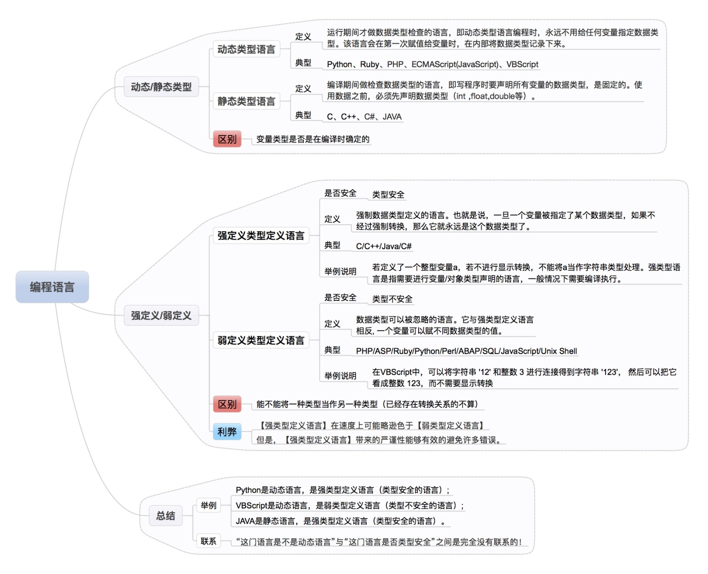

# 类型系统 type system

## wiki

[wiki 类型系统](https://zh.wikipedia.org/zh-sg/%E9%A1%9E%E5%9E%8B%E7%B3%BB%E7%B5%B1#%E5%BC%B7%E5%9E%8B%E5%88%A5%E5%92%8C%E5%BC%B1%E5%9E%8B%E5%88%A5)

- 类型系统主要功能: 安全性、优化、可读性、抽象化/模块化
- 类型检查所进行的检验处理以及实行类型的约束，可发生在编译时期（静态检查）或运行时期（动态检查）。静态类型检查是在编译器所进行语义分析中进行的。如果一个语言强制实行类型规则（即通常只允许以不丢失信息为前提的自动类型转换）就称此处理为强类型，反之称为弱类型。
- 如果一个编程语言的类型检查，可在不测试运行时期表达式的等价性的情况下进行，该语言即为静态类型的。如果一个编程语言支持运行时期（动态）调度已标记的资料，该语言即为动态类型的。
- 强类型的基本定义即为，禁止错误类型的参数继续运算。弱类型意指一个语言可以隐式的转换类型（或直接转型）。

## 静态类型 vs 动态类型

> Static typing when possible, dynamic typing when needed.

按类型检查来分，可以分为静态类型和动态类型。

简单区分方法:

1) 静态类型：在编译时就知道变量类型（编译期间做类型检查），在定于数据类型的时候需要声明数据类型。

2) 动态类型：运行时才知道变量类型，大部分直接采用变量＝值的语法。

- 静态代表: Java, C/C++, Golang等; 动态代表: Python, Ruby等。

- 程序都需要进行错误检查，比如除0错误，那么在什么时候检查呢？静态类型多是在编译时，动态类型多是在程序运行时。语言里有类型检查的机制，来报类型错误。
- 从写代码的角度对比

||static|dynamic|
|---|---|---|
|Convenience|可以不用检查变量x是不是number|可以根据需要返回不同类型，静态类型就需要去构造一个新的数据类型才能实现|
|Catching bugs earlier|编译时就能发现类型上的错误|运行时才能发现|
|Performance|快|慢|
|Code reuse|通过泛型、子类型等|重用率更高，因为没有严格的类型系统|
|Prototyping|效率比不上动态类型，但能更好的记录整个系统prototyping的过程|更适合原型开发，类型上更自由|
|Evolution & Maintaince|类型检查会列出需要更改的地方，避免一些bug|改代码时可以把代码能接受的变得更宽泛|

- 由于强类型语言一般需要在运行时运行一套类型检查系统，因此强类型语言的速度一般比弱类型要慢，动态类型也比静态类型慢，因此执行的速度应该是C > Java > JavaScript > Python。但是强类型，静态类型的语言写起来往往是最安全的。

## 强类型 vs 弱类型

强类型语言是指编程语言在处理数据类型的运算时的校验非常严格（类型安全），相反的弱类型语言的校验就会较为宽松（类型不安全）。

简单区分方法：

1) 强类型：不允许隐式转换。一旦变量被指定某个数据类型，如果不经强制转换，即永远是此数据类型。

2) 弱类型：允许隐式转换。数据类型可以被忽略，一个变量可以赋不同数据类型的值。

